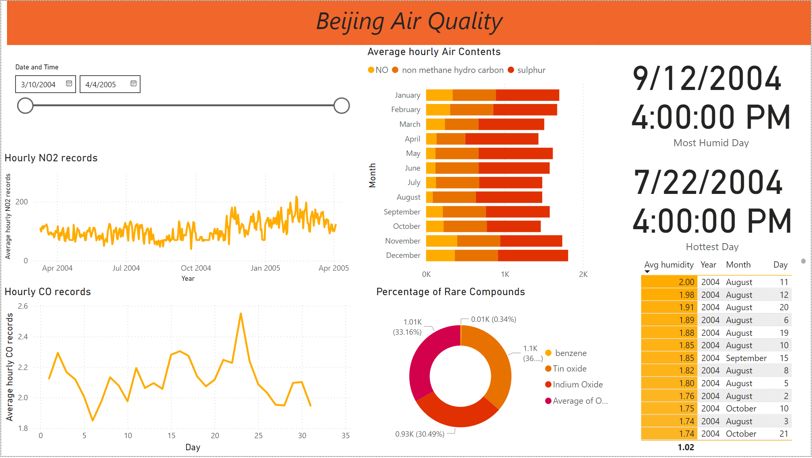

# Beijing Air Quality Dashboard

## 🎯 Overview

Welcome to the Beijing Air Quality Analysis project! This repository showcases a comprehensive Power BI dashboard analyzing air quality measurements in Beijing. By visualizing and analyzing various pollutants and environmental factors, we aim to provide actionable insights for understanding and improving air quality.



## 🔑 Key Features

- 📊 Real-time Air Quality Monitoring
- 📈 Pollutant Trend Analysis
- 🌡️ Temperature & Humidity Tracking
- 🕒 Temporal Pattern Recognition
- 🔄 Interactive Filtering & Drill-down

## 📚 Dataset Description

The dataset comes from the UCI Machine Learning Repository and includes:

### 🔍 Key Measurements

- 💨 Multiple air pollutants (CO, NO2, SO2, O3)
- 🌡️ Temperature (Celsius)
- 💧 Relative & Absolute Humidity
- ⚗️ Oxide compounds (Tin oxide, Indium oxide)
- 🧪 Other compounds (Benzene, Non-methane hydrocarbons)

### ⏰ Time Coverage

- March 2004 to 2005
- Hourly measurements
- Complete 24/7 monitoring

## 🧹 Detailed Data Cleaning Methodology

### 1. 📝 Initial Data Assessment

- **Source Validation**
  - Verified UCI ML Repository data
  - Checked time period consistency
  - Validated measurement units

### 2. ⚡ Date-Time Processing

```powerquery
// Example of date-time merge
= Table.CombineColumns(
    Table,
    {"Date", "Time"},
    Combiner.CombineTextByDelimiter(" "),
    "DateTime"
)
```

### 3. 🔧 Missing Value Treatment

| Compound    | Replacement Value |
| ----------- | ----------------- |
| CO          | ≈ 2.2             |
| NO2         | ≈ 70              |
| Tin Oxide   | ≈ 1000            |
| Temperature | ≈ 7.8°C           |

## 💻 Technical Implementation

### 🔮 DAX Measures

```dax
// Hottest Day Calculation
Hottest Day =
CALCULATE(
    MAX('Air Quality'[Date and Time]),
    FILTER(
        'Air Quality',
        'Air Quality'[Temperature in C] =
        MAX('Air Quality'[Temperature in C])
    )
)
```

### 📊 Visualization Components

1. **Time Series Analysis** 📈

   - Hourly pollutant tracking
   - Monthly trend analysis
   - Year-over-year comparisons

2. **Compound Distribution** 🎨
   - Interactive pie charts
   - Stacked bar visualizations
   - Heat maps for concentration levels

## 🎮 Interactive Features

### 1. 🎚️ Filters & Slicers

- Time period selection
- Compound filtering
- Temperature range filtering

### 2. 🔍 Drill-Through Capabilities

- Hourly breakdowns
- Compound details
- Temperature correlations

## 🚀 Performance Optimizations

- ⚡ Query folding implementation
- 📊 Visual-level filtering
- 🔧 Data type optimization

## 📈 Key Insights

- Identified peak pollution periods
- Seasonal variation patterns
- Temperature-pollution correlations
- Impact of humidity on air quality

## 🛠️ Requirements

- Power BI Desktop
- Dataset from UCI Repository
- Basic understanding of:
  - 📊 Data visualization
  - 🧪 Air quality metrics
  - 📈 Time series analysis

## 🔮 Future Improvements

1. 📅 Seasonal analysis enhancement
2. 🤝 Correlation studies
3. ☁️ Weather pattern integration
4. 🔮 Predictive analytics

## 🙏 Acknowledgments

- UCI Machine Learning Repository
- Power BI Community
- Environmental Data Contributors

## 📬 Contact & Support

For questions and support:

- 📧 Create an issue
- ⭐ Star the repository
- 🔄 Fork for your own use

---

Made with 💖 for cleaner air and better data visualization
